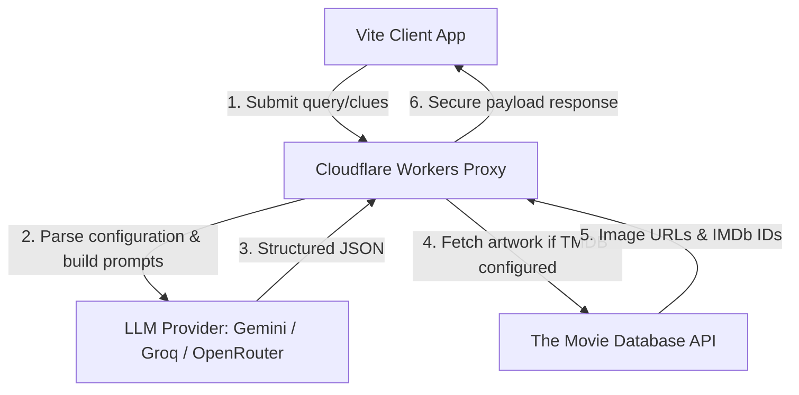

# Missing Frame

Missing Frame is an elite cinematic reconstruction tool designed to help you recover movie memories from fragmented, imperfect synapses. Built with a stark, minimal A24-style aesthetic, it focuses on high typography contrast, spacious layouts, and immersive poster-driven results rather than generic chatbot boxes or search lists.

---

## The Reconstruction Flow

1. **Step 1: The Synapse Console**
   Input whatever details you remember about the movie (even if they are contradictory or incorrect). Suggestions appear under the void text area to inspire memory recovery.

2. **Step 2: Clue Refinement**
   Review the status of AI-extracted memory chips. Toggle status indicators between Confirmed (✅) and Uncertain (⚠), double-click to edit labels, or discard inaccurate memory fragments.

3. **Step 3: Targeted Inquiry**
   If confidence remains low, the Detective Engine formulates a single, high-information-gain clarification question (e.g. *“Could the bionic arm have belonged to a visually similar actor like Laurence Fishburne instead?”*) rather than generic questions.

4. **Step 4: Candidate Dossier**
   View ranked movie candidates dominated by 2:3 aspect-ratio posters. Learn why each movie matches, view list of suspected memory errors (what you got wrong), and launch official YouTube trailers, IMDb, or TMDb dossiers.

---

## System Architecture



* **Client**: React 19, TypeScript, Tailwind CSS, Framer Motion, and Vitest.
* **Edge Worker**: Cloudflare Pages Function endpoint resolving provider selections securely.
* **Provider Abstraction**: A unified adapter system allowing switching LLM runtimes dynamically via `MOVIE_PROVIDER` configurations (`gemini` | `groq` | `openrouter`).
* **Client-side AI Integration**: Direct client-side calls to NVIDIA models managed via `AIManager` and parsed through the `useMovieRecovery` hook for "Noise vs Anchors" analysis.
* **Cryptographic Security**: Server keys reside inside the environment vault on Cloudflare, while client keys are loaded via Vite's `VITE_NVIDIA_API_KEY`.

---

## Local Development

### Installation

Install dependencies:
```bash
npm install
```

### Config Environment Variables

#### Backend (Cloudflare Pages Functions / Local `.dev.vars`)
Configure these variables inside your local `.dev.vars` or Cloudflare Pages settings:
* `MOVIE_PROVIDER`: `gemini` (default), `groq`, or `openrouter`
* `GEMINI_API_KEY`: Your Google Gemini API Key
* `GROQ_API_KEY`: Your Groq API Key
* `OPENROUTER_API_KEY`: Your OpenRouter API Key
* `TMDB_API_KEY`: Your The Movie Database Key (for posters and IMDb links)

#### Frontend (Vite / Local `.env` or `.env.local`)
Configure these variables for client-side AI direct calls:
* `VITE_NVIDIA_API_KEY`: Your NVIDIA API Key.
* `VITE_ACTIVE_MODEL`: The active NVIDIA model (defaults to `deepseek-ai/deepseek-v4-flash`). Candidate models include:
  * `deepseek-ai/deepseek-v4-flash`
  * `z-ai/glm-5.1`
  * `minimax/minimax-m2.7`
  * `mistralai/mistral-medium-3.5-128b`
  * `nvidia/llama-3.3-nemotron-super-49b-v1`

### CLI Commands

* **Run Development Server**:
  ```bash
  npm run dev
  ```

* **Execute Test Suite**:
  ```bash
  npm run test
  ```

* **Compile for Production**:
  ```bash
  npm run build
  ```
